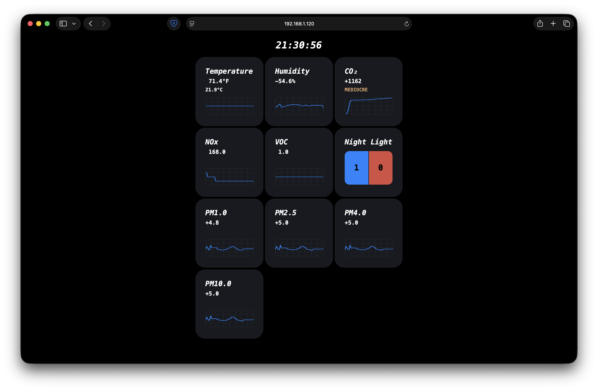
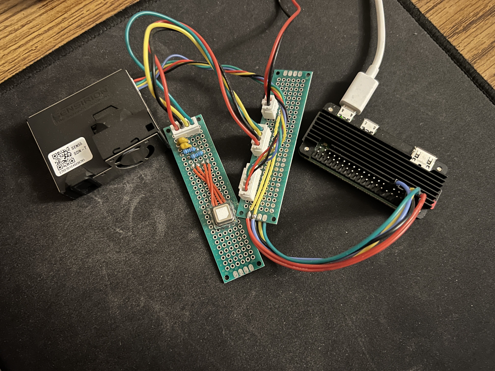
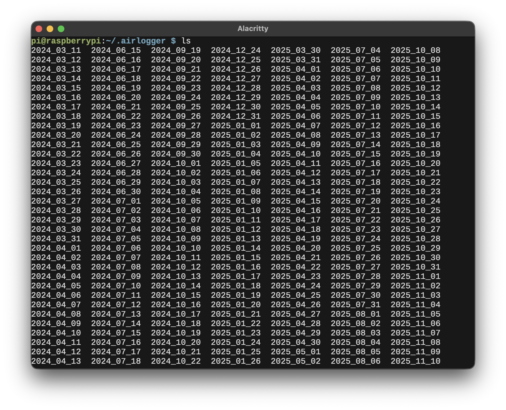
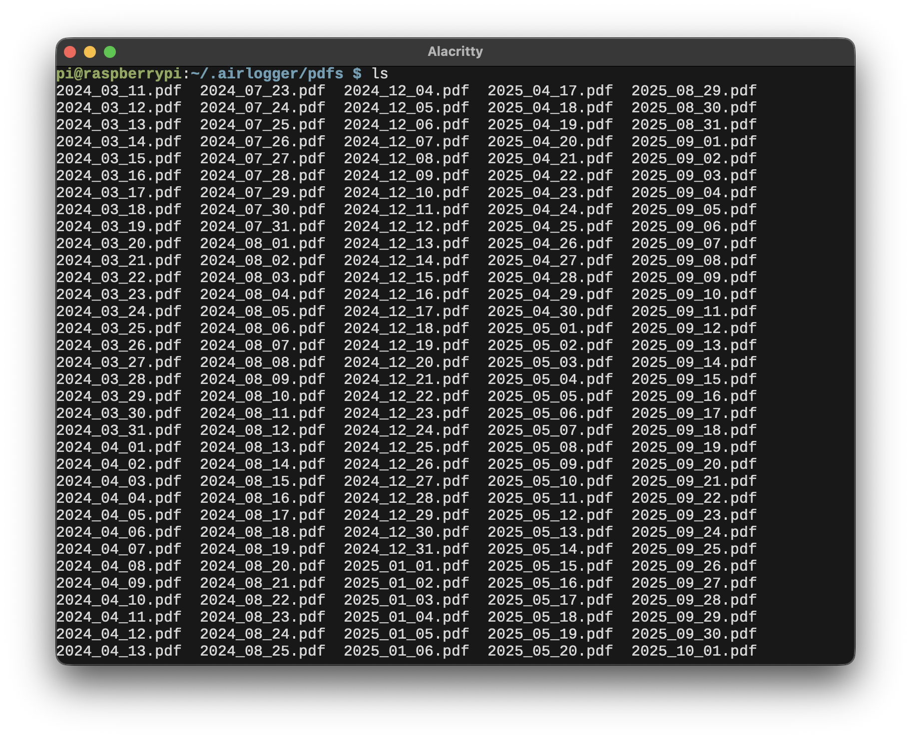
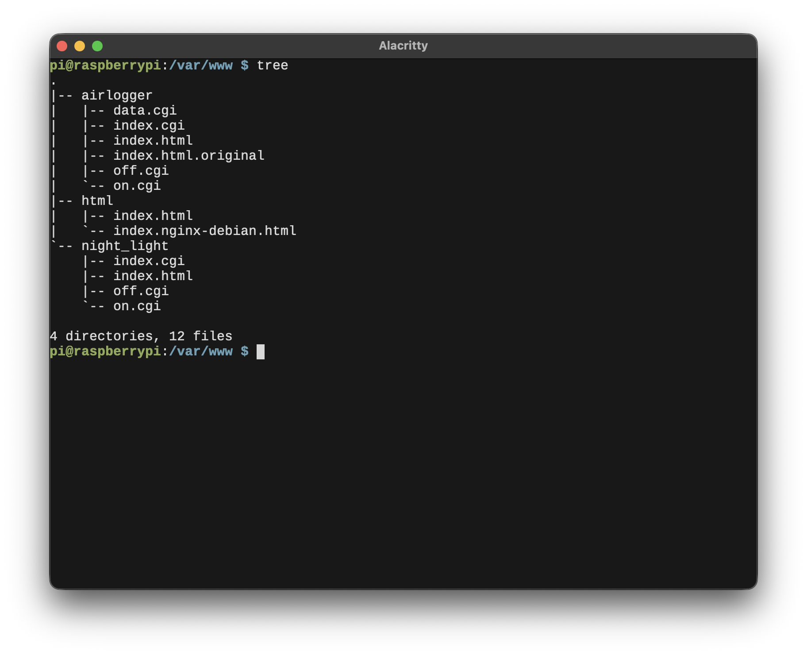

+++
date = '2026-01-09T22:00:00-08:00'
draft = false
title = 'DIY Indoor Air Quality Monitor'
summary = 'How I made made an indoor air quality monitor using Raspberry Pi and Sensirion sensors.'
+++

I have never given much tought to the quality of indoor air. My first
introduction to the monitoring of indoor air was with Amazon Smart Air
Quality Monitor, which absolutely sucked. For what it was worth, it was
useful and inticed me to explore more. The information provided by the air
quality monitors is useful because poor air quality can lead to health
issues and lower productivity. Personally for me, I found the Carbon Dioxide
measure to be the most important (which, unfortunately, the monitor from
Amazon did not provide). It increases noticebly when I feel anxious and do
exercise which gives a hint to increase ventiliation.

## The Problem

Firstly, why did I even decide to make an indoor air quality monitor? Are
there no solutions on the market? The answer is: for the fun of it.  More
generally, the solutions on the market are not as convinient and customizable.
Also, I hate all the awful companion apps that modern products use.
No, I do not want a shitty app (that is also somehow a blackhole of everything,
social media, store, etc.) that requires me to sell my soul in order
to use it.  Finally, I always had a fascination with how things work (the
amount of things I broke in my childhood to find out . . .). With this project,
I have learned interesting things. It reminds me of the quote from the
*Prelude to Foundation* by Isaac Asimov,

> The sky was almost cloudless, but it was a pale blue, as though wrapped
> in a high thin mist. That, thought Seldon, was a good touch, but suddenly
> he missed the sun itself. No one on Trantor saw the planet's sun unless
> he or she went Upperside and even then only when the natural cloud layer
> broke.
>
> Did native Trantorians miss the sun? Did they give it any thought? When
> one of them visited another world where a natural sun was in view,
> did he or she stare, half-blinded, at it with awe?
>
> Why, he wondered, did so many people spend their lives not trying to find
> answers to questions--not even thinking of questions to begin with? Was
> there anything more exciting in life than seeking asnwers?

## The Solution

## Implementation

To begin with, I used
[Raspberry Pi Zero 2 W](https://www.raspberrypi.com/products/raspberry-pi-zero-2-w/)
for this project which is capable of running the Linux operating system and
has onboard Wi-Fi. This is great because running an entire OS simplifies many
things and saves a lot of time on implementation. This way, I do not have to
write my own server, instead using [nginx](https://nginx.org/) to provide
static pages and API. Though, I most likely will write my own server in C
using UNIX sockets to make it more portable (nginx is a pain to setup; it
would be great to just compile and run). The very earliest versions of this
project used an Arduino Nano, display, and buttons to cycle parameters.
However, as you can see from the pictures, it is a lot more convenient to
funnel that information over to devices for greater convenience.

For the sensor, I have used an old SEN55 sensor that provides with
termperature, humidity, particulate matter, VOC and NOx. On top of that, I
really wanted to track CO₂ as it is an extremely important measure for the
health. The newer versions of SEN6X sensors, support Carbon Dioxide in one
package.  But, at the time of making the project, unfortunately, I had to
buy a seperate sensor SCD40 to track CO₂. Conveniently, the manufacturer
provides Arduino and Raspberry Pi libraries for the sensors, so there was
no need in implementing those on my own.

### Overall Architecture 

#### Daemon

I have written a daemon that communicates with the sensors and saves data
into a file every five seconds. For the greatest portability, the file
contains plain text data separated by spaces and new lines (any software
can read plain text and analyze it, unlike binary data). After a day of
recording, the average file size comes out to be 1M. At midnight, once the
daemon finishes the file for the day and continues to a new file, crontab
executes another program that fetches the weather data from
[open-meteo](https://open-meteo.com/en/pricing) using
[curl](https://curl.se/libcurl/), parses JSON, and produces a chart PDF.
This way, each PDF provides both indoor temperature and humidty for the day.
At most, this produces 31 API calls to open-meteo per month; the free plan
allows up to three hundred thousand calls per month.

[Example PDF](2025_04_04.pdf)

#### Front-end

The front-end was written utilizing HTML, JavaScript, and TailwindCSS. The
JavaScript polls the server API every two seconds for new data and updates
the charts. Also, the simple charts that display the trend line are drawn
onto the canvas with JavaScript.

#### Back-end

Since I have not written the server, yet, everything relies on nginx and
[fastCGI](https://nginx.org/en/docs/http/ngx_http_fastcgi_module.html)
module.  This way, I can use simple Bourne Shell scripts to fetch data from
storage and send off as plain text. Of course, to avoid the headache of
constantly hunting for the Pi's IP, the router needs to be configured to
assign a static IP for the Pi.

#### Convenience

I also display temperature and CO₂ in the status bar of GNOME
and MacOS. On Linux, to help comes a GNOME extension that allows executing
arbitrary scripts and displaying their outputs in the menu bar called
[Executor](https://extensions.gnome.org/extension/2932/executor/); On MacOS,
I have written my own program in Swift utilizing AppKit that provides the
same functionality, called [CmdBar](https://cmdbar.rednera.com).

#### Results

This server has been reliably running and collecting data for almost two
years, since March 11, 2024. The longest uninterrupted by electricity
outages and accidentals disconnects uptime was over half a year. I am yet
to sit down and do any sort of analysis on this data. However, at the time
of writing this, I am not sure what use it may provide (compared to, say,
monitoring of outside weather) since the indoor values are greatly influenced
by the air conditioning, purifiers, etc. But, I guess it can provide some
useful insights, like the average indoor CO₂ over the year. If it was worse
this year than the previous, it should give a hint to start making changes
(i.e. issues with ventilation).

Overall, the project provided a lot of interesting learning experience,
touching many areas of programming, like system administration, daemons,
UNIX signals, making HTTPS requests with curl, parsing json, writing charts,
producing PDFs, API, etc.
